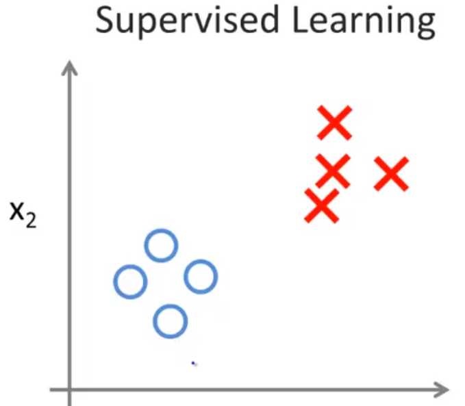

# Standford Machine Learning - Week 01

#### Tags
* Author : AH Uyekita
* Title  :  _Introduction_
* Date   : 22/02/2019
* Course : Machine Learning
    * **Instructor:** Andrew Ng

***

## Machine Learning

Spam filter, Google Search Engine, Photo Tagging are all examples of Machine Learning algorithms. The Definition of Machine Learning coined by Arthur Samuel.

>"Field of study that gives computers the ability to learn without being explicitly programmed" -- <cite>Arthur Samuel</cite>

Tom Mitchell has an improved definition of Machine Learning.

>"A computer program is said to learn from experience E with respect to some class of tasks T and performance measure P if its performance at tasks in T, as measured by P, improves with experience E." -- <cite>Tom Mitchell</cite>

Machine Learning could be divided into two big families:

* Supervised learning, and;
* Unsupervised learning.

Let's talk a bit more about these two groups.

#### Supervised learning

Here, we teach the algorithm how to do something based on past experience (database), which has the "right answers".

Figure 1 shows an example.

<em>Figure 1 - Supervised Learning Example task.</em>
 

The crosses are wrong answers and the circles the right.

>In supervised learning, we are given a data set and already know what our correct output should look like, having the idea that there is a relationship between the input and the output.
>
>Supervised learning problems are categorized into "regression" and "classification" problems. In a regression problem, we are trying to predict results within a continuous output, meaning that we are trying to map input variables to some continuous function. In a classification problem, we are instead trying to predict results in a discrete output. In other words, we are trying to map input variables into discrete categories.

#### Unsupervised learning

In this case the Machine Learning algorithm do not have any ideia of the right answer.

>Unsupervised learning allows us to approach problems with little or no idea what our results should look like. We can derive structure from data where we don't necessarily know the effect of the variables.

An example of Unsupervised Learning is the Clusterization process, which aims to find patterns/structures in the data.

### Model Representation

Figure 2 shows an example of Model Representation.

<em>Figure 2 - General Model.</em>
 

Where:

* Training Set: Dataset;
* Learning Algorithm: ML Algorithm;
* : the output of the ML Algorithm.

The , also called hypothesis, will take the `Size of house`as input to `estimate the price`.

### Linear Regression

The first classifier presented in this course is the Linear Regression because it is the easiest one. The equation (1) shows the formulation.

The optimization problem behind the Linear Regression is the minimization of the errors, which is the distance between the line estimated by the Linear Regression and the actual value. Recall, this is also called Cost Function.

#### Cost Function

Defining it in a equation (2).

Where:

* : The total number of observations (training dataset size);
* : The intercept;
* : The slope;
* : The estimated value of the  observation, and. It is also known as ;
* : The actual value of the  observation.

So, my objective is to minimize the .

#### Gradient Descent

This is a strategy to solve many problems. Figure 3 shows an example of the behaviour of this algorithm.

<em>Figure 3 - Gradient Descent.</em>
 

As you can see, the Gradient Descent is sensitive to the initial point, which means the results could be different if you choose different start points. All this is made, using the derivate of the  to sinalize the direction for each step (iteration).

Where:

* : Learning Reate;
* : Partial derivate.

The interpretation of the derivate is presented in Figure 4.

<em>Figure 4 - Partial Derivates.</em>
 

The derivate aims to update the value of each parameter. Graphicaly, when teh derivate is positive, we need to decrease the  substracting it from . In case of negatives values of derivates, we need to increase the value of .

**Learning Rate**

In a way to converge the algorithm, the Learning Rate aims to provide little steps toward to the local minimum. This is necessary because if the step is too big there is no convergence. Figure 5 shows it.

<em>Figure 5 - Learning Rate.</em>
 

Have in mind, according to the proximity to the local minimum the derivate value became smaller, which helps the convergence.

#### Gradient Descent in Linear Regression

Given the equations of Linear, Regression, Gradient Descent and the Cost Function of a Linear Regression.

* Linear Regression.

* Cost Function.

* Gradient Descent for  parameter.

Let's decompose equation (4) to take a look in the derivate component.

* Partial for .

Now, let's substitute the  by 0 and 1 in equation (5).

* 

* 

From equations (6) and (7), it is possible to update the equation (4).

Finally, given equation (8) and (9), you can calculate all the Gradient Descent to the Linear Regression.

Bear in mind, the Linear Regression Cost Function is convex, so there is no local optima and the algorithm should find the global maximum (or a value very close to it).

**Batch Linear Regression**

This is the way to calculate the Linear Regression presented so far, all the point is used to fit the line, but there are other approachs, which will be discussed later in the course.

(**)

