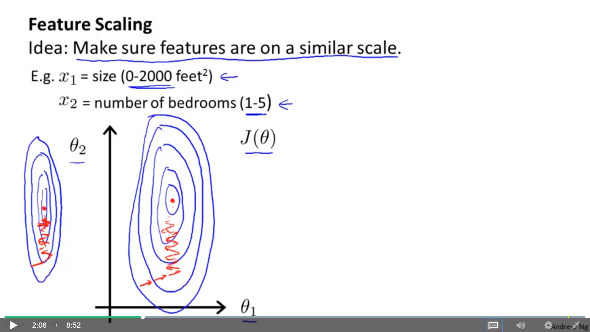
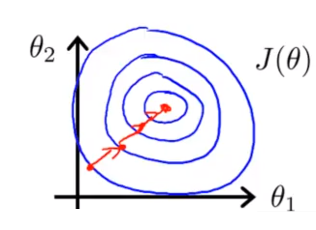

# Standford Machine Learning - Week 02

#### Tags
* Author : AH Uyekita
* Title  :  _Linear Regression with One Variable_
* Date   : 24/02/2019
* Course : Machine Learning
    * **Instructor:** Andrew Ng

***

## Multivariate Linear Regression

The Multivariate Linear Regression is a generalization of the Univariate Linear Regression. The Equation (1) shows it.

Where:

* : It is the observations value, and;
* : The feature/variable parameter;
* : Number of features, and;
* : Number of observations.

For convenience of notation, define  equal to 1. Converting equation (1) in matrix notation.

Where:

* : Row vector of parameters, and;
* : Column vector values.

### Gradient Descent in Multivariate Linear Regression

The process is almost the same, which differ is the quantity of the features. The Equation (3) shows the generic Cost Function.

Updating the parameters.

#### Feature Scaling

In some cases it is necessary to scale the features because the difference between ranges (of the features) could leverage the Gradient Descent convergence. It means if one feature has range from -3 to +3 and the other from -10.000 to +10.000, the difference is too high and the convergence process will last too much.

A way to understand it, is plotting a contours plot using the parameters as axis x and y, and the third axis as Cost Function. Figure 1 shows an example.

<em>Figure 1 - Contours Plot of Cost Function.</em>
 

Due to the skewness of this plot, the Gradient Descent will take several steps (iterations) doing a zig-zag by reach the center of the figure (where we supose it is the minimum value of ).

On the other hand, If you performs the feature scaling, Figure 1 will change to seems like Figure 2.

<em>Figure 2 - Contours Plot Scaled.</em>
 

As a result of the feature scaling, the convergence process in much faster.

The simplest way to do it is substracting the average and dividing it by the range, as shown in equation (5).

Where:

* : Feature ;
* : Average of all values of , and;
* : The subtraction of  and .

You can also use as range the standard deviation of .

.
