# Standford Machine Learning - Week 03

#### Tags
* Author : AH Uyekita
* Title  :  _Logistic Regression_
* Date   : 25/02/2019
* Course : Machine Learning
    * **Instructor:** Andrew Ng

***

## Logistic Regression

É um dos algoritmos mais populares e mais usados.

Exemplos:

* Uso na classificação de emails: Spam ou não spam
* Verificação de transações do comercio online: Fraudulento ou não?
* Tumor: Maligno ou Benigno

A idéia é **classificar** as variáveis conforme a nomenclatura:

Onde:

* 0: É a classe negativa (exemplo: tumor benigno)
* 1: É a classe positiva (exemplo: tumor maligno)

Há uma arbitratiedade na atribuição do que é 0 ou 1, mas há uma intuição de que a classe negativa (no nosso caso de exemplo tem valor de zero) transmite o sentido de **não ter alguma coisa** que no caso é não ter o tumor maligno. Ao passo que, a classe positiva transmite o sentido **de ter alguma coisa**, isto é, ter um tumor maligno.

Além da classificação binária há formas mais complexas, das quais envolvem multiclasses (que serão posteriormente discutida).

### Motivos para não usar Regressão Linear

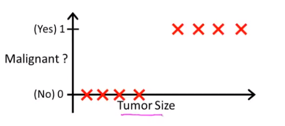

A classificação do problema acima é bem simples:

* Yes (1) : É maligno
* No  (0) : É benigno

Inicialmente, com uma abordagem simplista, pode-se usar a regressão como solução, conforme a figura 2.

Usa-se um limite em 0.5 separando pela metade o que é maligno e benigno. Aparentemente está tudo bem, mas ao estressar o modelo inserindo um "outlier" essa regressão pode ser alteradam conforme exibida na figura 3.

A idéia de traçar uma regressão linear simples não é a solução adequada visto que essa regressão será sensível ao outlier ou um ponto qualquer no extremo. Note que a linha azul que é a nova regressão após a inserção de novos pontos altera-se. Além disso, a adição de novas observações alterou a classificação de outras, onde se nota nitidamente que há dois grupos.

>Por este motivo não se deve usar a Regressão Linear para resolver problemas de classificação.

Lembre-se que para os problemas de regressão os valores de  podem assumir valores que são maiores de um ou menores de zero.

Já num problema de classificação os valores de y só assumem dois valores discretos: 0 ou 1. Desta maneira, necessitamos de uma hipótese () que fique compreendida entre esses dois limites (0 ou 1), onde qualquer valor acima de 0,5 seria 1 e todos abaixo desse valor 0.

### Logistic Regression

Nosso objetivo é ter uma hipótese entre 0 e 1.

Dessa maneira, devemos "invertar" uma hiótese que sintetize isso.

Lembre-se que a hipótese da regressão linear é conforme a equação 1

Já para a Regressão Logistica usaremos uma função sobre .

Onde:

* 

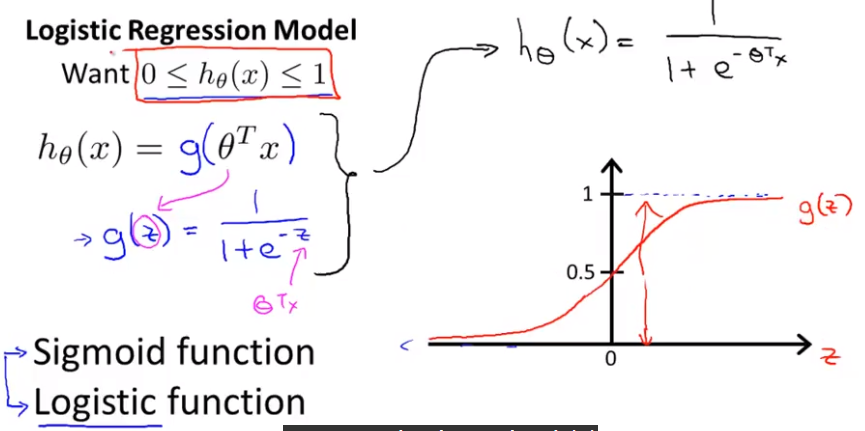

A função _Sigmoid_ ou Logística, possui duas retas assintóticas (0 e 1), das quais representam os nossos valores de y.

#### Interpretação

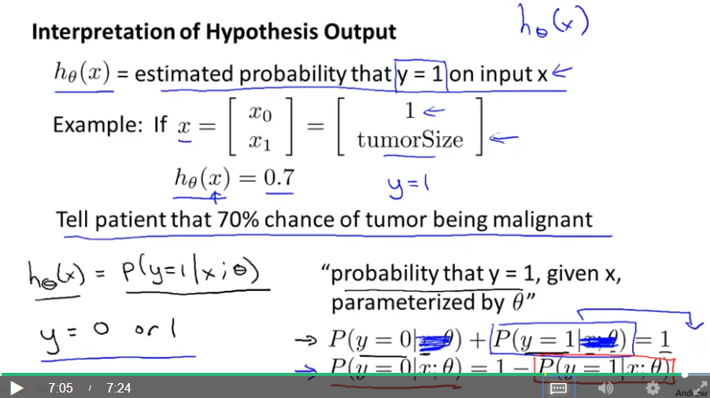

Deve-se interpretar os resultados da seguinte maneira:

 = probabilidade estimada dado que `y = 1` com entradas x;

Exemplo:

Se .
Se , a probabilidade que o tumor seja maligno é de 70%.

A probabilidade de que y seja (y = 1), dado X e parametrizado por . Que é equacionado como: 

## Decision Boundary (Fronteiras de Decisão)

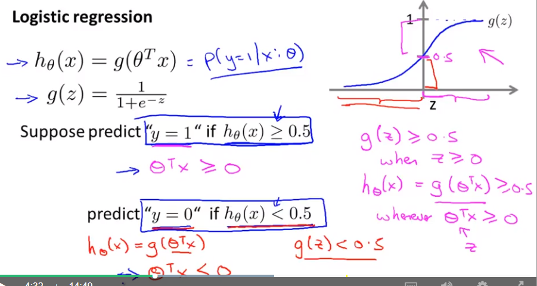

A figura 6 (acima) exemplifica o entendimento que devemos ter da função logística.

Para : Teremos um valor de  maior que 0.5 ( ) quando z for maior ou igual a zero (). Lembre-se que o  é o nosso , ou seja, sempre que  for maior ou igual a zero o valor de y será 1.

Substituindo  por , tem-se:

Para : Seria o "inverso".

### Exemplo - Linear Decision Boudary

Supõe-se que os valores de  são .

Com base na equação (4), substituímos os valores de .

Note que o resultado da equação (5) é uma reta, conforme a equação (6) e figura 8.

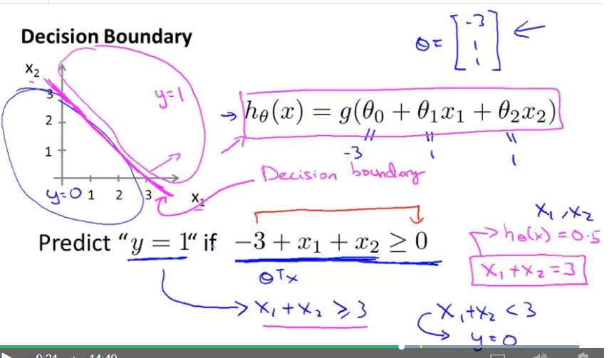

Dessa maneira, divide-se o espaço em duas partes por uma reta que é chamada de **decision boundary** que é equacionada por . Deve-se enteder o seguinte:

* Para que y seja 1 () a relação deve ser verdadeira para ;
* Para que y seja 0 () a relação deve ser verdadeira para ;

### Exemplo - Non-linear Decision Boudary

Pode-se usar um _decision boundary_ que não seja linear, tal como um círculo que será explanada neste tópico e elucidado na Figura 9. Note que a hipótese () possui elementos quadráticos.

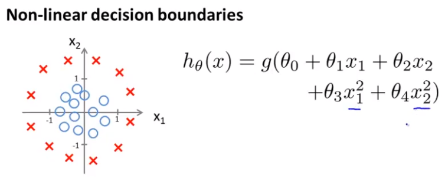

Analogamente ao exemplo anterior, vamos supor a escolha dos seguintes:

Desta maneira, a hipótese para que y seja 1, será **se**:

Portanto, a minha _decision boudary_ será similar à equação (7), que pode ser resumoda como uma equação de cículo!

* Fora do círculo: `y = 1`;
* Dentro do círculo: `y = 0`.

A figura 10 apresenta o desenho final com o _decision boudary_.

Observe que o _decision boundary_ é calculado a partir dos parâmetros estabelecidos e não do _training set_.

## Cost Function

Recapitulando com a ajuda da figura 11.

O _Cost Function_ base será aquele apresentado na regressão linear, conforme a equação (9).

Note que o `1/2` foi posto dentro do somatório (o que não altera nada já que é uma constante). Substituindo o somatório por uma outra função, temos:

Onde o  é:

Para os problemas de regressão linear, a função  é uma função convexa, isto é, ela não possui mínimos locais, o que atrapalha na convergência de uma solução usando o método do gradiente descendente. Para o caso da função logística a função de hipótese () é uma função bem complicada, conforme a equação (11), e infelizmente essa função não é convexa.

A Figura 12 apresenta os exemplos de desenhos de um  `não convexo` e `convexo`.

Desta maneira, substitui-se o _Cost function_ da regressão linear por:

Vamos analisar essas duas equação separadamente.

A Figura 13 apresenta o gráfico de comportamento da nova _Cost Function_ para `y = 1`.

Se estamos analisando a equação para `y = 1`, quando  é 1, tem-se um valor de `Cost` igual à zero, mas caso o valor de  esteja aproximando-se de zero o valor de `Cost` tenderá ao infinito. Isto captura a intuição de que  (para o caso de `y = 1`) terá um . Além disso, terá um alto valor de `Cost` quando se aproximar de zero.

A Figura 14 apresenta o gráfico de comportamento da nova _Cost Function_ para `y = 0`.

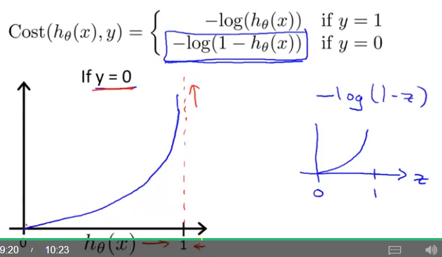

Bom de maneira análoga, se estamos analisando a equação para `y = 0`, quando  é zero, tem-se um valor de `Cost` igual à zero, mas no caso de o valor de  esteja aproximando-se de 1 o valor de `Cost` tenderá ao infinito.

### Simplified Cost Function and Gradient Descent

A partir das equações (10) e (12), pode-se resumir a equação (12) para uma única equação.

Agora substituindo a equação (13) na equação (10).

>O motivo de escolher essa função  é devido ao Método de Máxima Verossimilhança. Usa-se esse método para estimar os parâmetros.

Logo, a partir da nova equação de  o nosso objetivo é minimizar esse valor variando-se o . Note que o novo _Cost Function_ possui as boas características de ser convexo. Portanto, pode-se usar a mesma técnica utilizada para a regressão linear que é o _Gradient Descent_, conforme elucida a figura 15.

A equação (15) apresenta o cálculo dos .

Substituindo a derivada parcial de , tem-se:

Agora representando a equação de maneira matricial, onde j é a quantidade de parâmetros da hipótese.

## Advanced Optimization

É um capítulo que aborda basicamente o uso de funções `built-in` do Octave.

Inicialmente deve-se criar uma função que tenha como código algumas funções. Esta função será utillizada por uma segunda que fornecerá os dados definidos na primeira função.

* Derivadas parciais
* 

## Multiclass Classification - One vs All Method

Este caso é a aplicação do algoritmo de _Logistic Regression_ tradicional, mas com um novo formato. O objetivo é marcar, por exemplo, emails como sendo de trabalho, amigos, família e hobbies, logo, são 4 classes.

A Figura 16 exemplifica um problema de Regressão Logística com 3 classes.

O idéia é simples e consiste na aplicação de várias Regressões Logísticas escolhendo uma classificação (classe positiva) e pondo o restante na classe negativa. Desta maneira, caso tenhamos 3 classificações, faremos 3 regressões logísticas, pois é uma combinação  = .

## Regularization

Este capítulo discorrerá tanto sobre _Linear Regression_ e _Logistic Regression_, pois este conceito aborda ambas, adiante cada um deles terá o seu próprio sub-tópico.

O que é um problema de _Overfitting_ e de _Underfitting_?

A Figura 17, apresenta um resumo de tais tipos de problemas para a Regressão Linear.

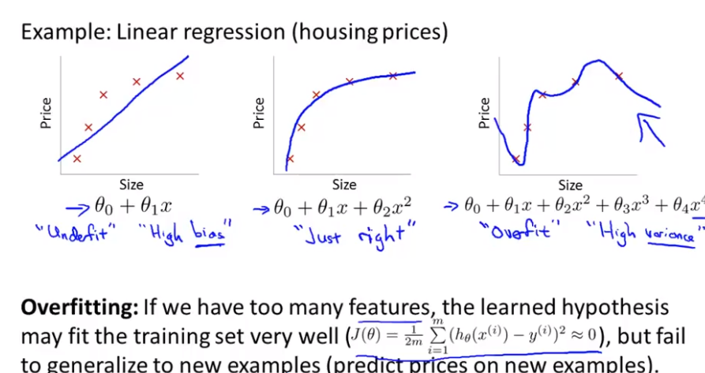

O _Underfitting_ é um problema de falta de parâmetros e o _Overfitting_ é uma quantidade exagerada de parâmetros, este último pode ter até mesmo um  igual à zero, mas possui muitas curvas em seu _decision boundary_ impossibilitando a generalização do modelo, sendo também não factível uma fronteira dessa maneira.

Note que estes mesmo conceitos de _Over_ ou _Underfitting_ podem ser levados para a Regressão Logística. A Figura 18 apresenta alguns exemplos para o caso de Regressão Logística.

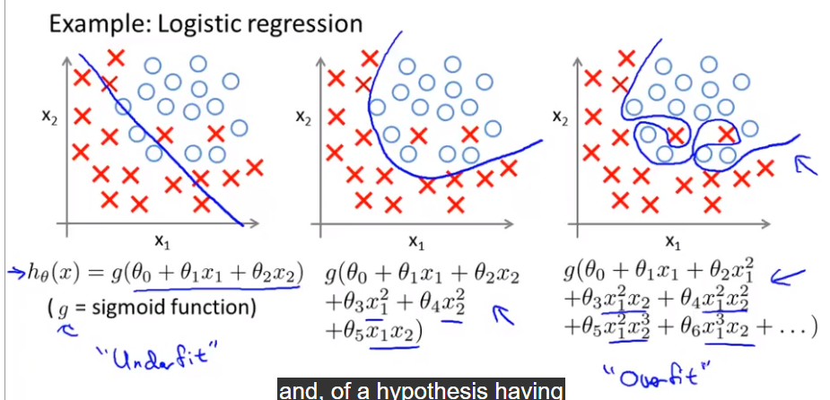

Uma razão do _Overfitting_ que é latente: Quando a quantidade de observações (_training data_) é menor que das características (variáveis).

Há duas formas/opções de resolver esse problema:

* Reduzir a quantidade de variáveis;
       * Reduzir manualmente analisando caso a caso das variáveis e elegendo qual permanecerá e qual será descartado;
       * Usando o _selection algorithm_ que será apresentado adiante do curso;
* _Regularization_
       * mantém todas as características (variáveis), mas reduz a magnitude (os valores de $\theta_j$);
       * Funciona bem quando há muitas variáveis e cada um contribui um pouco para prever/estimar $y$.

Infelizmente, ao remover/eliminar uma variável haverá uma perda de informação para não incorrer nesse problema usa-se o _regularization_.

### _Cost Function_

Conforme já elucidado o _Overfitting_ é um problema quando há muitos parâmetros  no modelo, o que gera um bom resultado no que tange o , pois o minimiza, contudo não é bom para generalizar devido à sua grande quantidade de curvas e também não é nada factível que a _decision boundary_ seja neste formato. A Figura 19 apresenta uma comparação entre um mesmo _data training_ e a hipótese adotada.

O problema de otimização ate então utilizado, isto é, a **função objetivo** é dado pela equação (18).

Esta equação (18) que busca minimizar a soma dos quadrados será modificada ao inserir dois novos elementos (dois novos s), mas com uma penalização para que eles s sejam pequenos. A equação (19) elucida essa alteração.

Observe que a função de minimização buscará minimizar os valores de  e , pois o valor arbitrário `1000` sempre deixará  elevado, para compensar isso os s serão bem baixos. Isso mitigará os efeitos dos  e , conforme elucida a Figura 20.

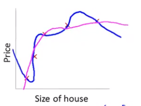

Os conceitos usados para _Regularization_ são:

* Pequenos valores para os parâmetros ;
       * Resultarão em hipóteses simples;
       * Menos propenso a ter um overfitting.

Desta maneira, para o exemplo de venda de casa que o _data training_ possuía 100 características (_features_ ou variáveis) e consequentemente outros 100 parâmetros. Há muitos s e há um problema em qual desses muitos parâmetros/_features_ escolher para a regressão logística. Portanto, usa-se uma técnica que é aplicar o conceito supracitado de penalizar os parâmetros, mas em todos eles (do  ao ). A nova equação  é mostrada na equação (20).

Observe que o  está fora do somatório (que está em **REGULARIZATION PARAMETER**) o que significa que ele não será afetado pela penalização. Isso é porque a influência dele estar ou não é tão pequena que não faz diferença nos resultados, além disso a **convenção** é não inserí-lo no somatório.

O  é responsável pelo _trade-off_ entre dois objetivos:

* Treinar e obter bons valores de , e;
       * Isso a partir da parcela da soma dos quadrados;
* Manter os parâmetros s diminutos e evitar o _Overfitting_;
       * A partir do _Regularization Parameter_.

A Figura 21 apresenta um gráfico onde há duas curvas.

A linha em azul representa a regressão sem a regularização, ao passo que a linha rosa é aquela que possui a regularização. Note que a nova regressão é bem menos sinuosa, o que reflete mais a realidade e o torna generalista.

Note que poderá ocorrer casos de _underfitting_ se os valores de  forem demasiadamente elevados, tornando os valores de s tendendo à zero, sobrando então somente o , pois pela convenção ele não entra no _Regularization Parameter_. Uma outra maneira de se referir a esse tipo de problema é dizer que está com um forte viés ou "preconceito". A Figura 22 apresenta uma ilustração de como ficaria a regressão (uma reta paralela ao eixo abscissa).

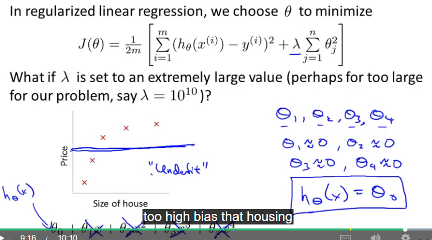

Desta maneira, deve-se escolher o valor de  cuidadosamente.

## _Regularized Linear Regression_

Especificamente sobre o _Regularized Linear Regression_ haverá uma pequena alteração no cálculo do , note que  será calculado de maneira distinta, pois ele não é afetado pelo _Regularization Parameter_ e os demais 's serão simplificados. As equações (21) e (22) apresentam as novas formulações para este caso de regressão.

Portanto, para resolver esse problema pode-se recorrer ao _Gradient Descent_ como já foi utilizado na regressão linear "simples".

Para o caso de usar _Normal Equations_ há alguns benefícios de usar a _regularização_, pois ela lida bem com a não invertibilidade de , isto é, para o caso com regularização a matriz que será invertida será aquela com o parâmetro  adicionado ao , a equação (23) ilustra isso.

## _Regularized Logistic Regression_

Analogamente à _Regularized Linear Regression_ para o caso da Regressão Logística Regularizada será adicionado ao _Cost Function_ o parâmetro para penalizar os s. A Figura 24 apresenta um _recap_.

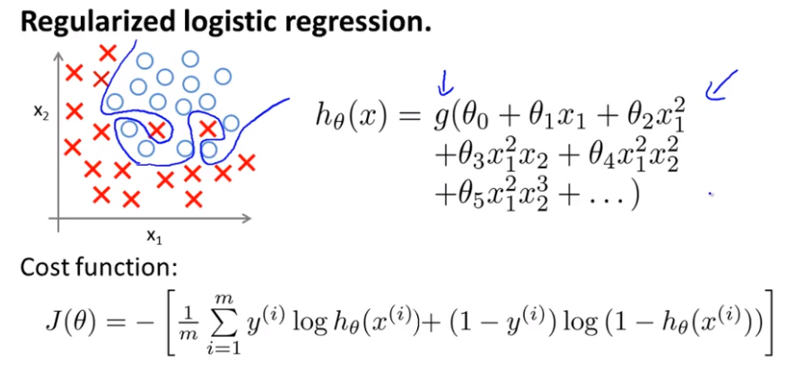

Note que a nova equação para o cálculo do _Cost Function_ será de acordo com a equação (24).

Aplicando-se a formula supracitada (24), tem-se como resultado um gráfico (linha rosa) conforme ilustrado na Figura 25.

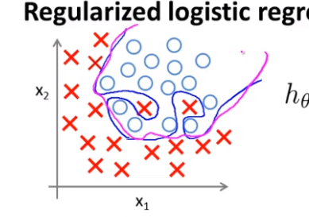

A atualização dos s seguirá um roteiro parecido com o modelo regularizado de regressão linear, tendo somente que ressaltar que a hipótese () é uma função sigmóide (ou logística), sendo assim uma equacionado parecido, mas não igual à regressão linear regularizada. A figura 26 apresenta as equações.

O uso de algoritmos de otimização avançados, pode ser feita a partir da seguinte rotina descrita na Figura 27.

