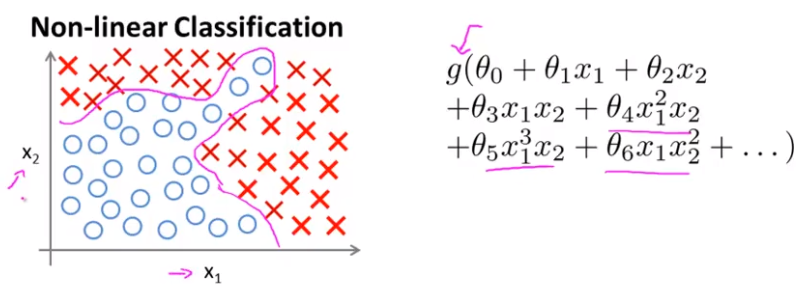
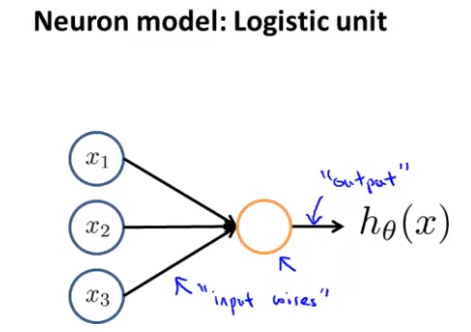
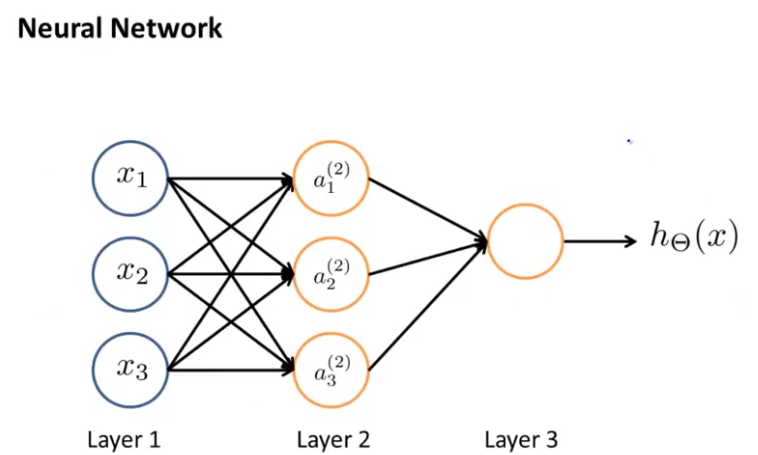
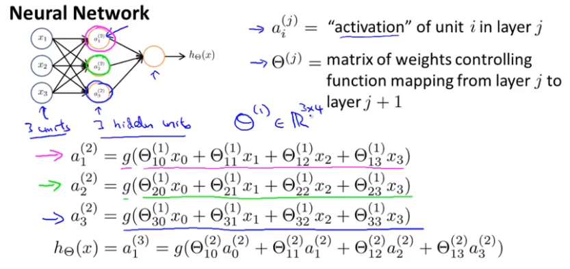
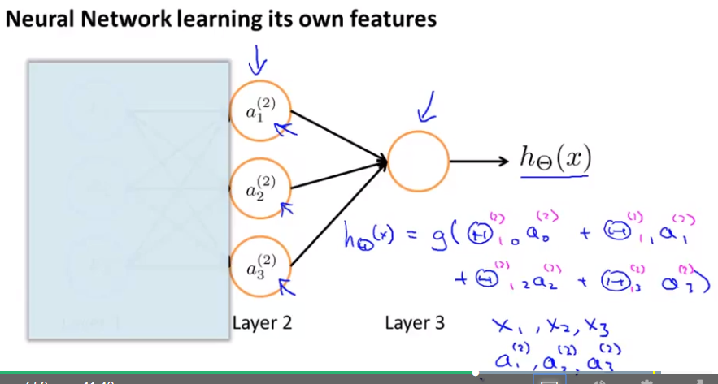
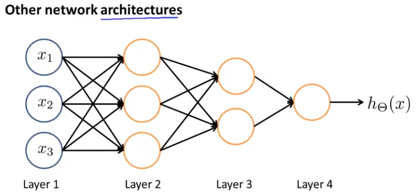
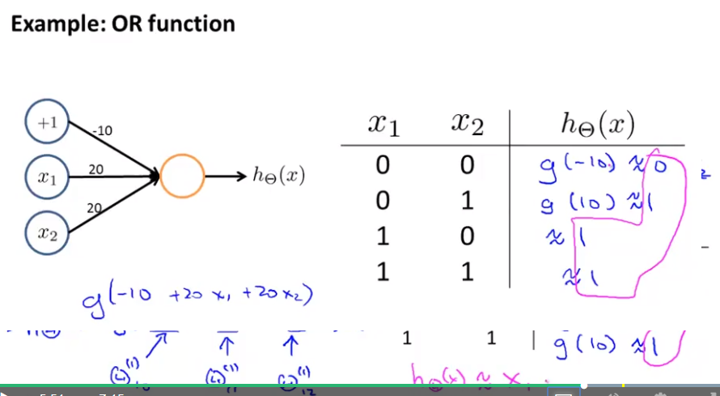
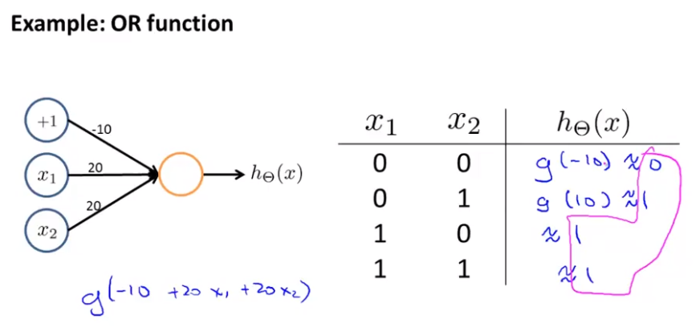
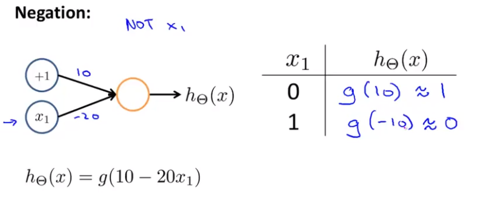
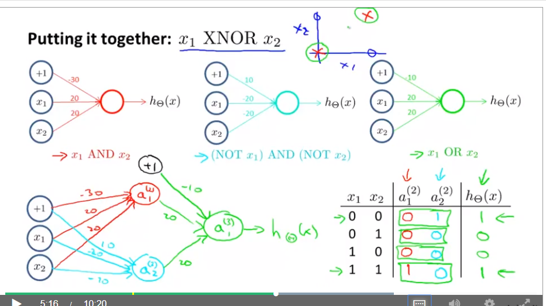

```{r setup, include=FALSE}
knitr::opts_chunk$set(echo = TRUE)
```

# _Non-linear hypotheses_

## Introdução

O motivo para ter que usar as redes neurais para os problemas de _machine learning_ é justamente quando temos problemas nos modelos já aprendidos nas aulas passadas (_Logistic Regression_ e _Linear Regression_).

O exemplo da Figura 1 é de um problema de classificação que só tem duas classes, até aí o _Logistic Regression_ pode resolver muito bem, o problema acontece quando há muitas características envolvidas.



Note que a hiótese adotada é polinomial e bem complexa e normalemnte os problemas de _Logistic Regression_ da vida real tem muitas características (_features_). O problema da Figura 1 é um exemplo de 100 _features_ o que pode ter um explosão combinatorial que impossibilitaria o uso da _Logistic Regression_. Uma alternativa é fazer um _subset_ de todas as _features_ para criar uma nova hipótese, contudo os resultados não serão suficientemente bons igual à linha rosa da Figura 1. Desta maneira, a _Logistic Regression_ para um problema com n _features_ muito elevada não será uma boa ideia e por isso se usa o _Neural Network_.

## Neural Networks

Origem: Imitar o funcionamento do cérebro humano.

Foi amplamente usado no anos 80 e começo dos 90 e sua populariedade diminuiu no final dos anos 90, recentemente resurgiu como o estado da arte para diversas aplicações. O problema antigo era que computacionalmente o _Neural Network_ era muito custoso para ser performado, o que nos recentes anos tornou-se factível com o advento computacional dos computadores.

### The single learn algorithm

A teoria desse algoritmo é que qualquer parte do cérebro é capaz de aprender qualquer coisa, isto é, o cérebro tem um tipo de algoritmo que é capaz de aprender tudo. A analogia por trás disso é que quando há algum dano severo no cérebro ele é capaz de realocar uma parte do cérebro que realizar as funções da parte afetada.

A representação do neurônio no contexto de _Neural Network_ é descrito conforme a Figura 2.



Onde o corpo é a parte amarela, a flechas entrando no corpo são os _inputs_ e a flecha saindo do corpo é o _output_. Observe que o $h_\theta(x) = \frac{1}{1 = e^{-\theta^T}}$ é a hipótese, onde $x = \begin{bmatrix} x_0 \\ x_1 \\ x_2 \\ x_3 \end{bmatrix}$ e $\theta = \begin{bmatrix} \theta_0 \\ \theta_1 \\ \theta_2 \\ \theta_3 \end{bmatrix}$.

Normalmente, desenha-se a _Neural Network_ com base nas entradas (_inputs_) $x_0, \dots ,x_1$, conforme ilustrado na Figura 2, mas às vezes será desenhado também o $x_0$ que possui um nome especial, _bias unit_ ou _bias neuron_, ressalta-se que o _bias unit_ será 1, então ele será desenhado algumas vezes e outras não.

Outras terminologias do _Neural Network_ é que eles chamam a função sigmóide (ou logística) de _activation function_, além disso, os valores de $\theta$'s podem ser chamados de _weights_ (pesos).

A Figura 3 apresenta um _Neural Network_ mais complexo, já que a Figura 2 só tem um neurônio.



Ressalta-se que se pode inserir também a figura oculta do $a_0^{(2)}$ que é o _bias unit_. Continuando com o novo vocabulário de _Neural Network_, define-se: 

* _Layer 1_ é chamado também de _input layer_ (x);
* _Layer 3_ é chamado de _output layer_ (y);
* _Layer 2_ é chamdo de _hidden layer_.

A Figura 4 apresenta um exemplo de redes neurais e suas equações.



A tradução dessa figura é seguir as flechas.

* $a_1^{(2)}$ é a composição de $x_n$'s multiplicado pelos seus $\Theta$'s;
* $a_2^{(2)}$ e $a_3^{(2)}$ são calculados da mesma forma;
* Para o caso de $a_1^{(3)}$ que é a saída (_output_) pode-se calcular a partir dos $a_n^{(2)}$'s, sendo $a_1^{(3)}$ o próprio $h_\Theta(x)$.

A representação matricial pode ser descrita como:

$$a_1^{(2)} = g(\underbrace{\Theta_{10}^{(1)}x_0 + \Theta_{11}^{(1)})x_1 + \Theta_{12}^{(1)})x_2 + \Theta_{13}^{(1)})x_3}_{z_1^{(2)}} = g(z_1^{(2)})\\
a_2^{(2)} = g(\underbrace{\Theta_{20}^{(1)}x_0 + \Theta_{21}^{(1)})x_1 + \Theta_{22}^{(1)})x_2 + \Theta_{23}^{(1)})x_3}_{z_2^{(2)}} = g(z_2^{(2)})\\
a_3^{(2)} = g(\underbrace{\Theta_{30}^{(1)}x_0 + \Theta_{31}^{(1)})x_1 + \Theta_{32}^{(1)})x_2 + \Theta_{33}^{(1)})x_3}_{z_3^{(2)}} = g(z_3^{(2)})$$

Define-se $\hat x = \begin{bmatrix}x_0\\x_1\\x_2\\x_3\end{bmatrix}$ e $z^{(2)} = \begin{bmatrix}z_1^{(2)}\\z_2^{(2)}\\z_3^{(2)}\end{bmatrix}$.

Além disso, pode-se resumir que $z^{(2)} = \Theta^{(1)}x$ e $a^{(2)} = g(z^{(2)})$. Observe que o _activation input_ possui índice 2, isso porque os $x$'s são na realidade o de índice 1. Logo, tem-se que $\begin{bmatrix} x_1 \\ x_2 \\ x_3 \end{bmatrix} = \begin{bmatrix} a_1^{(1)} \\ a_2^{(1)} \\ a_3^{(1)}\end{bmatrix}$.

Neste exemplo há a presença do $a_1^{(3)}$ e, portanto, do $z^{(3)}$.

$$h_\Theta(x) = a_{1}^{(3)} = g(\underbrace{\Theta_{10}^{2}a_{0}^{(2)} + \Theta_{11}^{2}a_{1}^{(2)} + \Theta_{12}^{2}a_{2}^{(2)} + \Theta_{13}^{2}a_{3}^{(2)}}_{z^{(3)}} ) = g(z^{(3)})$$
Ressalta-se a presença de $a_0^{(2)}$ (que possui valor 1) em $a_1^{(3)}$, logo $a^{(2)}$ pertence ao $R^4$.

Com base no supracitado tem-se que $h_\Theta(x)$ é igual a:

$$h_\Theta(x) = a^{(3)} = g(z^{(3)})$$
O processo de chamado de propagação é o fato dos _activation inputs_ passarem pelos neurônios e chegarem até o final ($h_\Theta(x)$).

A Figura 5 apresenta a analogia entre uma parte do _Neural Network_ e a _Logistic Regression_.



Note que em teoria, a Figura acima elucida que _Neural Network_ e a _Logistic Regression_ são bem parecidas até este ponto, sendo somente distinta a nomenclatura das variáveis e o fato do _Neural Network_ ter entradas os $a_n^{(2)}$, isto é, não é exatamente o _activation inputs_ (as _features_ originais).

A novidade em se usar um _layer 2_ é o fato do algortimo por si só ter a capacidade de aprender e selecionar as características mais importantes, isto é, não é mais necessário a escolha de uma hipótese complexa, pois a rede neural fará isso escolhendo/aprendendo nos vários _layers_ que possuir.

Desta maneira, introduz-se o conceito de _network architectures_, pois se refere como os neurônios são conectados, já que a forma que eles se conectam refletem no seu aprendizado. A Figura 6 apresenta um exemplo de arquitetura.



### Exemplos - Logic `AND`

As redes neurais podem ser usadas para simular as portas lógicas (todas elas), começaremos simulando a porta lógica `AND`. A Figura 7 apresenta a representação do _Neural Network_.



Surpreendentemente, substituindo os valores de $x_1$ e $x_2$, obtém-se valores de $h_\Theta(x)$ que são exatamente os resultados de uma porta lógica tipo `AND`. Isso só acontece porque os valores de $\Theta(x)$ estão bem calibrados.

### Exemplo - Porta Lógica `OR`

A Figura 8 apresenta o _Neural Network_ da porta lógica `OR`.



### Exemplo - Porta Lógica `NOT`

A Figura 9 apresenta o _Neural Network_ da porta lógica `NOT`.



### Exemplo - Porta Lógica `XNOR`

A Figura 10 apresenta o _Neural Network_ da porta lógica `XNOR` que possui um _hidden layer_. Essa implementação é impressionante!!



